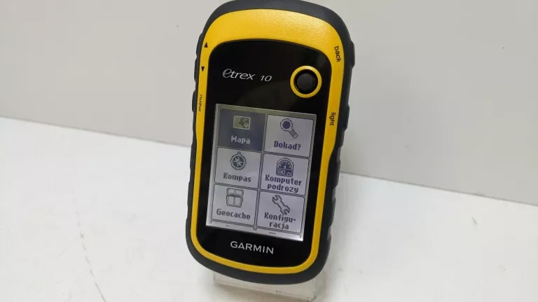
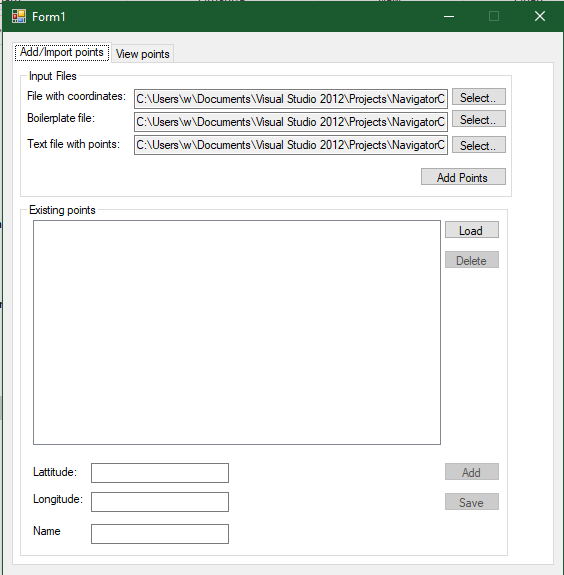
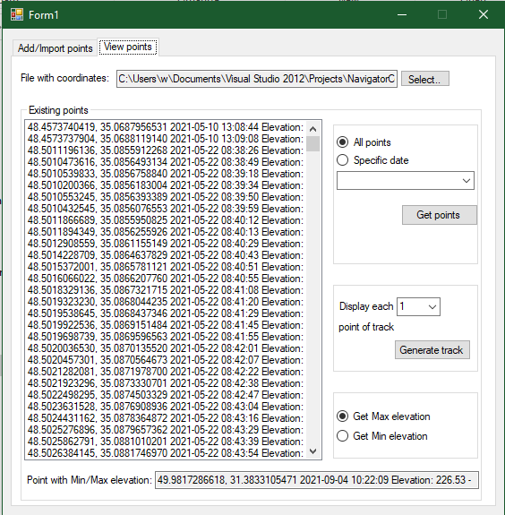
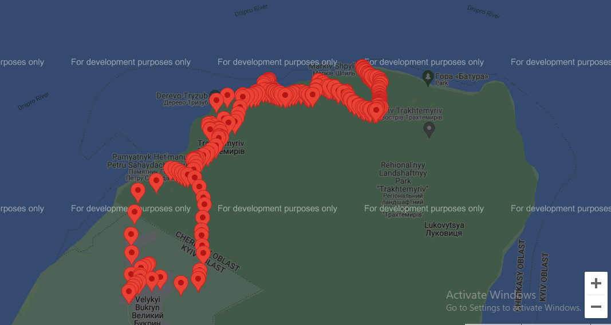
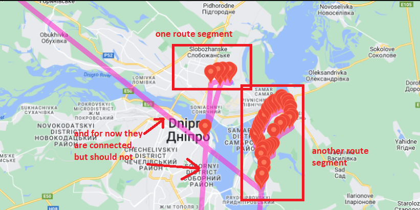

# GPS Navigator helper

A small React/Typescript app for automation interactions with GPS navigator

## The purpose and background of an application

I have a GPS Navigator Garmin etrex 10.



Very handy device: simple, reliable and lightweight (152 gramms including batteries !). The only way to get or put there data (points/routes) is to upload/download there .gpx (xml-like format) files via USB-cable.

So once I got an idea to write a small application that will automate adding and getting way point for my travelings. Initially I've implemented this using C# and WinForms. Now it looks like so:




There even exist functionality to show those points in Google Maps. I've investigated possibility to integrate online maps with desktop .NET app but realized that it not that quick and simple, so decided to stick with a hybrid "lower-friction solution". To show points from my navigator I've used html and javascript with Google Map. The boilerplate html page looks like so:

```
<!DOCTYPE html>
<html>
 <head>
   <meta name="viewport" content="initial-scale=1.0, user-scalable=no" />
   <style type="text/css">
     html { height: 100% }
     body { height: 100%; margin: 0; padding: 0 }
     #map-canvas { height: 100% }
   </style>
   <script type="text/javascript"
     src="https://maps.googleapis.com/maps/api/js?key=<very-very-secret-api-key>&sensor=false">
   </script>
   <script type="text/javascript"
     src="1.js">
   </script>
 </head>
 <body>
   <div id="map-canvas"/>
 </body>
</html>
```

1.js - is a file that was automatically generated by WinForms App based on gps points, and it looks like so

```
var map;
function initialize() {
	var mapOptions = {
        center: new google.maps.LatLng(49.9724345561, 31.3308280148),
	zoom: 4
       };

map = new google.maps.Map(document.getElementById("map-canvas"),  mapOptions);


const marker0 = new google.maps.Marker({position: {lat: 49.9724345561, lng: 31.3308280148}, map: map});
const marker10 = new google.maps.Marker({position: {lat: 49.9721662514, lng: 31.3300236873}, map: map});
const marker20 = new google.maps.Marker({position: {lat: 49.9721674249, lng: 31.3300233521}, map: map});
const marker30 = new google.maps.Marker({position: {lat: 49.9720412772, lng: 31.3301619887}, map: map});
const marker40 = new google.maps.Marker({position: {lat: 49.9734326731, lng: 31.3341350108}, map: map});
//then many-many other points
}
google.maps.event.addDomListener(window, 'load', initialize);
```

And I've got such result in browser


## What I'm gonna do next ?

If to be short - rewrite this application using more sutable tech stack. I've just passed recently [a great course regarding Typescript](https://www.udemy.com/course/typescript-the-complete-developers-guide) (including its integration with React/Redux). And one of the learning projects of this course was just dedicated to smooth Google Maps integration using Typescript.

So, as the puzzle is complete, and I have all I need, I am gonna to implement the following:

- Get a points from navigator and show the route on Google Maps
- Point out on the map desired points and save them for using on navigator
- Support gpx files from another providers
- TBD later...

## Garmin etrex 10 data format

GPS point on this navigator has a following format

```
<?xml version="1.0" encoding="UTF-8"?>
<gpx xmlns="http://www.topografix.com/GPX/1/1" xmlns:gpxtpx="http://www.garmin.com/xmlschemas/TrackPointExtension/v1" xmlns:gpxx="http://www.garmin.com/xmlschemas/GpxExtensions/v3" xmlns:wptx1="http://www.garmin.com/xmlschemas/WaypointExtension/v1" xmlns:xsi="http://www.w3.org/2001/XMLSchema-instance" creator="eTrex 10" version="1.1" xsi:schemaLocation="http://www.topografix.com/GPX/1/1 http://www.topografix.com/GPX/1/1/gpx.xsd http://www.garmin.com/xmlschemas/GpxExtensions/v3 http://www8.garmin.com/xmlschemas/GpxExtensionsv3.xsd http://www.garmin.com/xmlschemas/WaypointExtension/v1 http://www8.garmin.com/xmlschemas/WaypointExtensionv1.xsd http://www.garmin.com/xmlschemas/TrackPointExtension/v1 http://www.garmin.com/xmlschemas/TrackPointExtensionv1.xsd">
  <metadata>
    <link href="http://www.garmin.com">
      <text>Garmin International</text>
    </link>
    <time>2020-03-13T10:31:39</time>
  </metadata>
  <wpt lat="48.407651" lon="35.204222" xmlns="">
    <time>2020-03-13T10:31:39</time>
    <name>1Povorot</name>
    <cmt />
    <sym>Flag, Blue</sym>
  </wpt>
</gpx>
```

_wpt_ tag describes the point itself.

And here how looks like track recorded by this navigator (we need this to get the point of the route).

```
<?xml version="1.0" encoding="UTF-8" standalone="no" ?>
<gpx
	xmlns="http://www.topografix.com/GPX/1/1"
	xmlns:gpxx="http://www.garmin.com/xmlschemas/GpxExtensions/v3"
	xmlns:wptx1="http://www.garmin.com/xmlschemas/WaypointExtension/v1"
	xmlns:gpxtpx="http://www.garmin.com/xmlschemas/TrackPointExtension/v1" creator="eTrex 10" version="1.1"
	xmlns:xsi="http://www.w3.org/2001/XMLSchema-instance" xsi:schemaLocation="http://www.topografix.com/GPX/1/1 http://www.topografix.com/GPX/1/1/gpx.xsd http://www.garmin.com/xmlschemas/GpxExtensions/v3 http://www8.garmin.com/xmlschemas/GpxExtensionsv3.xsd http://www.garmin.com/xmlschemas/WaypointExtension/v1 http://www8.garmin.com/xmlschemas/WaypointExtensionv1.xsd http://www.garmin.com/xmlschemas/TrackPointExtension/v1 http://www.garmin.com/xmlschemas/TrackPointExtensionv1.xsd">
	<metadata>
		<link href="http://www.garmin.com">
			<text>Garmin International</text>
		</link>
		<time>2021-05-27T15:40:04Z</time>
	</metadata>
	<trk>
    <name>Текущий трек: 22 МАЙ 2021 11:38</name>
		<trkseg>
			<trkpt lat="48.5011196136" lon="35.0855912268">
				<ele>87.62</ele>
				<time>2021-05-22T08:38:26Z</time>
				<extensions>
					<gpxtpx:TrackPointExtension>
						<gpxtpx:cad>0</gpxtpx:cad>
					</gpxtpx:TrackPointExtension>
				</extensions>
			</trkpt>
			<trkpt lat="48.5010473616" lon="35.0856493134">
				<ele>78.97</ele>
				<time>2021-05-22T08:38:49Z</time>
				<extensions>
					<gpxtpx:TrackPointExtension>
						<gpxtpx:cad>0</gpxtpx:cad>
					</gpxtpx:TrackPointExtension>
				</extensions>
			</trkpt>
			<trkpt lat="48.5010539833" lon="35.0856758840">
				<ele>73.20</ele>
				<time>2021-05-22T08:39:18Z</time>
				<extensions>
					<gpxtpx:TrackPointExtension>
						<gpxtpx:cad>0</gpxtpx:cad>
					</gpxtpx:TrackPointExtension>
				</extensions>
			</trkpt>
      ...other of a track segment points
    </trk>
    <trk>
    ...other track within same gpx file
  	</trk>
</gpx>
```

So here we need to get _lat_ and _lon_ attributes of _trkpt_ within _trk_ and _trkseg_ tags.

# Support gpx files from another providers

Add ability to parse and build routes from gpx files from other providers

## Nakarte gpx data format

[nakarte](https://nakarte.me) has the following data format, here is an exmple of the route

```
<?xml version="1.0" encoding="UTF-8" standalone="no" ?>
<gpx xmlns="http://www.topografix.com/GPX/1/1" creator="http://nakarte.me" xmlns:xsi="http://www.w3.org/2001/XMLSchema-instance" xsi:schemaLocation="http://www.topografix.com/GPX/1/1 http://www.topografix.com/GPX/1/1/gpx.xsd" version="1.1">
	<metadata>
		<time>2024-08-21T07:30:32.073Z</time>
	</metadata>
	<trk>
		<name>Вздовж_Сури_2</name>
		<trkseg>
			<trkpt lat="48.446126" lon="35.028300"><time>1970-01-01T00:00:01.000Z</time></trkpt>
			<trkpt lat="48.445933" lon="35.028128"><time>1970-01-01T00:00:01.000Z</time></trkpt>
			<trkpt lat="48.446105" lon="35.027721"><time>1970-01-01T00:00:01.000Z</time></trkpt>
			...
		</trkseg>
	</trk>
</gpx>
```

## Choosing implementation tools

After some expriments decided to use for Google Maps integration [react-google-maps library](https://www.npmjs.com/package/@vis.gl/react-google-maps), it has a great [documentation](https://developers.google.com/codelabs/maps-platform/maps-platform-101-react-js#4) and a rich amount of [different samples](https://github.com/visgl/react-google-maps/tree/main/examples/geometry/src). Of course the previous choice predefine using React/Redux as a base of application. For working with xml firstly going to use [xml2js](https://www.npmjs.com/package/xml2js) package, but spent quite a lot of time but could not properly figure out with it (looks like it has some problems with React and(or) Typescript integrations) :smile: So then decided to stick with a native solution using [DOMParser](https://developer.mozilla.org/en-US/docs/Web/API/DOMParser).

## Changelog

- [0.4.3](https://github.com/vitalikr215/gps-navigator-helper/releases/tag/0.4.3) Implemented showing on GoogleMap separate points from .gpx file that contains only points
- [0.5.3](https://github.com/vitalikr215/gps-navigator-helper/releases/tag/0.5.3) Implemented parsing .gpx file that contains routes. Show this route on GoogleMap based on route points and connect these points with a polyline.
  <br>\* found out that if the number of poins added to GoogleMap more than 300 rendering become a slow and lags appered. So, when show routes, going to add just first and last point of the route (to reduce a number of points added to map). Another one findig is that route could consist of several segments (it's a straight analog of different journey with your navigator). Such segments separated by _<trkseg>_ tag on .gpx file and know last point of previous segment connected with first point of next segment which is looks weird
  
  <br>So, then next going to draw different route segments with different polylines, and also will make them different color for better user experience, to explicitly show that it's a different journey.
- [0.6.4](https://github.com/vitalikr215/gps-navigator-helper/releases/tag/0.6.4) Fixed that routes are mixed up between each other, by drawing them in separate polyline and different colors. Also now adding only first and last point of the route segment for better user experience.
- [0.7.9](https://github.com/vitalikr215/gps-navigator-helper/releases/tag/0.7.9) Implemented new route mode where you could add points by double click on GoogleMap. Also added a sidebar where you could see coordinates and names of added points and delete them if needed. For now you're not able to save added points to .gpx file and can't edit names of the points(for now I am using current timestamp for their naming). This will be done in upcoming versions.

### _To be continued..._
